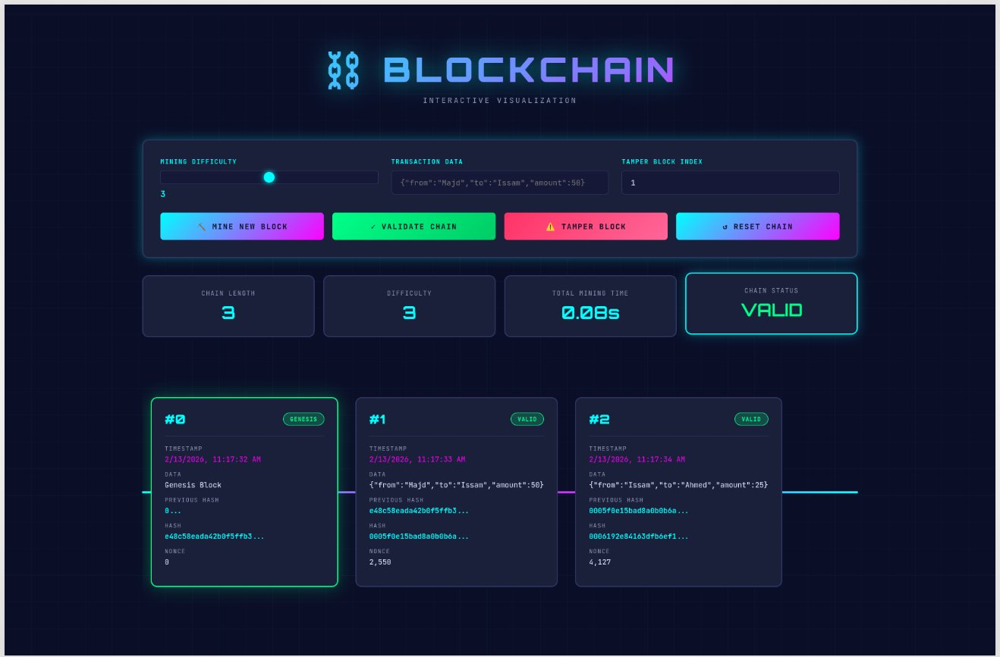

# Ruby Blockchain Implementation

<div align="center">


</div>

A simple yet comprehensive blockchain implementation in Ruby that demonstrates the core concepts of blockchain technology including hashing, proof-of-work, and chain validation.



*Interactive web interface with real-time blockchain visualization, cyberpunk aesthetics, and live mining animations.*

## 🎯 Features

- **Block Creation**: Each block contains an index, timestamp, data, previous hash, current hash, and nonce
- **Proof of Work (Mining)**: Configurable difficulty for mining blocks
- **Chain Validation**: Verify the integrity of the entire blockchain
- **Tamper Detection**: Automatically detects if any block has been modified
- **JSON Export**: Export the blockchain to JSON format
- **Genesis Block**: Automatic creation of the first block in the chain
- **🎨 Interactive Web Interface**: Beautiful real-time visualization with cyberpunk aesthetics
- **REST API**: Full API for blockchain operations

## 🌟 Web Interface Highlights

<div align="center">
  
</div>

**Features:**
- 🎨 **Cyberpunk Design** - Neon colors, animated grid backgrounds, smooth transitions
- ⛏️ **Live Mining** - Watch blocks being mined in real-time with visual feedback
- 📊 **Statistics Dashboard** - Track chain length, difficulty, mining time, and validation status
- 🔍 **Tamper Detection** - Test blockchain security by modifying blocks
- 🎯 **Interactive Controls** - Adjustable difficulty, custom transactions, one-click validation
- 📱 **Responsive** - Works on desktop, tablet, and mobile devices

## 📚 How It Works

### The Block Structure

Each block in the blockchain contains:

```ruby
{
  index: 0,                    # Position in the chain
  timestamp: 1234567890,       # Unix timestamp
  data: "transaction data",    # Any data you want to store
  previous_hash: "abc123...",  # Link to previous block
  hash: "def456...",          # This block's unique identifier
  nonce: 12345                # Proof-of-work number
}
```

### Proof of Work (Mining)

Mining is the process of finding a valid hash for a block. The difficulty determines how many leading zeros the hash must have:

- Difficulty 1: Hash must start with "0"
- Difficulty 2: Hash must start with "00"
- Difficulty 3: Hash must start with "000"
- And so on...

The miner increments the `nonce` until finding a hash that meets the difficulty requirement. This is computationally expensive, which is what makes blockchains secure.

### Chain Validation

The blockchain validates itself by checking:

1. Each block's hash is correctly calculated
2. Each block properly references the previous block's hash
3. All blocks meet the proof-of-work difficulty requirement

If any block is tampered with, the validation fails.

## 🚀 Usage

### Web Interface (Recommended!)

The easiest way to interact with the blockchain is through the beautiful web interface:

1. **Install dependencies**:
```bash
bundle install
```

2. **Start the web server**:
```bash
ruby server.rb
```

3. **Open your browser** to `http://localhost:4567`

**Web Interface Features**:
- 🎨 Real-time blockchain visualization with cyberpunk aesthetics
- ⛏️ Mine new blocks with visual feedback
- 🔍 Validate the entire chain
- ⚠️ Tamper with blocks to see security in action
- 📊 Live statistics and status indicators
- 🎯 Adjustable mining difficulty
- ✨ Smooth animations and responsive design


### Command Line Interface

### Basic Example

```ruby
require_relative 'blockchain'

# Create a new blockchain with difficulty 3
blockchain = Blockchain.new(3)

# Add a block with transaction data
blockchain.add_block({
  from: "Alice",
  to: "Bob",
  amount: 50
}.to_json)

# Display the blockchain
blockchain.display

# Validate the blockchain
puts blockchain.valid? # => true
```

### Running the Demo

```bash
ruby blockchain.rb
```

This will:
1. Create a blockchain with difficulty 3
2. Add several transaction blocks
3. Display the complete blockchain
4. Demonstrate tamper detection

### Expected Output

```
🔗 Simple Blockchain Implementation in Ruby
============================================================

Mining block 0...
Block mined: 000abc123...

Mining block 1...
Block mined: 000def456...

============================================================
BLOCKCHAIN (Difficulty: 3)
============================================================
Block #0
Timestamp: 2025-02-12 10:30:45
Data: Genesis Block
Previous Hash: 0
Hash: 000abc123...
Nonce: 12345
------------------------------------------------------------
...
Chain is VALID ✓
============================================================
```

## 📖 API Reference

### REST API Endpoints

The web server provides a full REST API:

#### `GET /api/chain`
Get the complete blockchain with all blocks.

```bash
curl http://localhost:4567/api/chain
```

#### `POST /api/mine`
Mine a new block with custom data.

```bash
curl -X POST http://localhost:4567/api/mine \
  -H "Content-Type: application/json" \
  -d '{"data": {"from":"Alice","to":"Bob","amount":50}}'
```

#### `POST /api/difficulty`
Change the mining difficulty (1-6).

```bash
curl -X POST http://localhost:4567/api/difficulty \
  -H "Content-Type: application/json" \
  -d '{"difficulty": 4}'
```

#### `POST /api/tamper`
Tamper with a specific block (for testing).

```bash
curl -X POST http://localhost:4567/api/tamper \
  -H "Content-Type: application/json" \
  -d '{"index": 1, "data": "TAMPERED"}'
```

#### `GET /api/validate`
Validate the blockchain integrity.

```bash
curl http://localhost:4567/api/validate
```

#### `POST /api/reset`
Reset the blockchain to genesis.

```bash
curl -X POST http://localhost:4567/api/reset
```

### Blockchain Class

#### `new(difficulty = 2)`
Creates a new blockchain with the specified mining difficulty.

```ruby
blockchain = Blockchain.new(3)
```

#### `add_block(data)`
Mines and adds a new block to the chain with the given data.

```ruby
blockchain.add_block("Transaction: Alice -> Bob: 50 BTC")
```

#### `valid?`
Validates the entire blockchain, returns `true` if valid.

```ruby
blockchain.valid? # => true
```

#### `display`
Prints the entire blockchain to the console in a readable format.

```ruby
blockchain.display
```

#### `to_json`
Exports the blockchain to JSON format.

```ruby
json = blockchain.to_json
```

### Block Class

#### `new(index, data, previous_hash)`
Creates a new block (usually called internally by the blockchain).

#### `mine_block(difficulty)`
Performs proof-of-work mining on the block.

#### `calculate_hash`
Calculates the SHA-256 hash of the block.

## 🔒 Security Features

### Immutability
Once a block is added and mined, changing its data invalidates the entire chain from that point forward.

### Proof of Work
The computational cost of mining makes it expensive to create fraudulent chains.

### Cryptographic Hashing
SHA-256 ensures that even tiny changes to data result in completely different hashes.

### Chain Linking
Each block references the previous block's hash, creating a tamper-evident chain.

## 🎓 Educational Concepts

This implementation demonstrates:

1. **Hashing**: Using SHA-256 to create unique block identifiers
2. **Proof of Work**: The mining process that secures the blockchain
3. **Chain Structure**: How blocks link together via hashes
4. **Validation**: How to verify blockchain integrity
5. **Immutability**: Why blockchains are resistant to tampering

## 🛠️ Requirements

- Ruby 2.5 or higher
- Bundler (for web interface)
- Modern web browser (Chrome, Firefox, Safari, Edge)

**For Web Interface**:
```bash
gem install bundler
bundle install
```

**For Command Line Only**:
- Standard library only (no external gems required)

## 📝 Example Use Cases

### Simple Transaction Ledger

```ruby
blockchain = Blockchain.new(2)

blockchain.add_block({
  type: "payment",
  from: "Alice",
  to: "Bob",
  amount: 100,
  currency: "USD"
}.to_json)
```

### Document Timestamping

```ruby
blockchain.add_block({
  type: "document",
  hash: Digest::SHA256.hexdigest(document_content),
  timestamp: Time.now.to_i,
  author: "John Doe"
}.to_json)
```

### Supply Chain Tracking

```ruby
blockchain.add_block({
  type: "shipment",
  product: "Widget XYZ",
  from: "Factory A",
  to: "Warehouse B",
  quantity: 1000
}.to_json)
```

## ⚠️ Limitations

This is a simplified educational implementation. Production blockchains include:

- Network consensus mechanisms (not just single-node)
- Transaction validation and digital signatures
- Merkle trees for efficient verification
- Smart contracts
- Peer-to-peer networking
- Wallet management
- Much more sophisticated mining algorithms

## 🤝 Contributing

Feel free to fork this repository and submit pull requests. Some ideas for improvements:

- Add transaction signing with public/private keys
- Implement a Merkle tree for transactions
- Add network simulation with multiple nodes
- Enhance the web UI with more visualizations
- Create mobile-responsive improvements
- Add dark/light theme toggle
- Implement WebSocket for real-time updates
- Add a REST API client library

## 📄 License

MIT License - feel free to use this code for learning and education.

## 🔗 Learn More

- [Bitcoin Whitepaper](https://bitcoin.org/bitcoin.pdf) - The original blockchain paper
- [Blockchain Demo](https://andersbrownworth.com/blockchain/) - Interactive blockchain visualization
- [Mastering Bitcoin](https://github.com/bitcoinbook/bitcoinbook) - Comprehensive blockchain book

---

**Note**: This is an educational implementation to understand blockchain fundamentals. Do not use in production without significant enhancements for security, scalability, and consensus.
